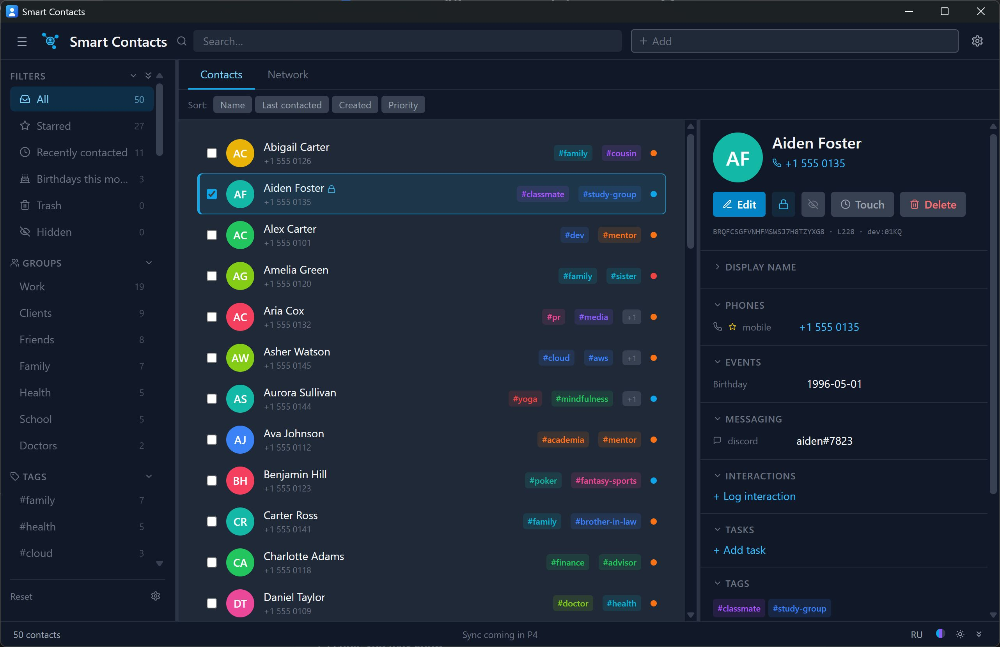

# Smart Contacts

Decentralized, offline-first contact manager. Three distribution targets share `shared/` core logic and `web/`'s React UI:

- **`web/`** — debug-only browser SPA (Vite dev server). Used by the Claude Code agent for verification.
- **`tauri/`** — desktop release (Win / macOS / Linux) via Tauri 2 with native SQLite.
- **`pwa/`** — mobile release (Android first) via Capacitor 6 with native SQLite.



Spec: `docs/superpowers/specs/2026-04-29-contacts-app-design.md`. Distribution targets — §22.

## Workspace layout

```
shared/   pure logic, types, repos, sync engine, i18n
web/      React UI shell, wa-sqlite + IndexedDB persistence
tauri/    Tauri 2 wrapper — reuses web's UI with @tauri-apps/plugin-sql
pwa/      Capacitor 6 mobile shell — Android, native SQLite
```

`pnpm` workspace; Node ≥ 20.

## Quick start

```bash
pnpm install
pnpm typecheck && pnpm lint && pnpm test && pnpm build
```

## Web (debug)

```bash
pnpm dev:web
```

Opens `http://localhost:5173/`. Persistence via wa-sqlite + IndexedDB. Use Settings → Demo to load 50 sample contacts.

## Tauri (desktop)

### Prerequisites

Tauri 2 requires the Rust toolchain on the host machine (the `pnpm` package alone is not enough). Follow the platform-specific guide at <https://v2.tauri.app/start/prerequisites/>:

- **Linux**: build-essential, libwebkit2gtk-4.1-dev, libssl-dev, libgtk-3-dev, libayatana-appindicator3-dev, librsvg2-dev.
- **macOS**: Xcode Command Line Tools.
- **Windows**: Microsoft Visual Studio C++ Build Tools + WebView2.

Then install Rust:

```bash
curl --proto '=https' --tlsv1.2 -sSf https://sh.rustup.rs | sh
```

### Dev

```bash
pnpm dev:tauri          # frontend Vite dev server only (port 1420)
pnpm --filter @smart-contacts/tauri tauri dev   # full Tauri shell (Rust + WebView)
```

The first `tauri dev` invocation downloads and compiles Rust dependencies — expect 5-10 minutes. Subsequent runs are incremental.

### Build

```bash
pnpm --filter @smart-contacts/tauri tauri build
```

Output:

- Linux: `tauri/src-tauri/target/release/bundle/{deb,appimage}/`
- macOS: `tauri/src-tauri/target/release/bundle/{dmg,macos}/`
- Windows: `tauri/src-tauri/target/release/bundle/{msi,nsis}/`

### What works

- All web features: contacts CRUD, network dashboard, bulk operations, undo/redo, hidden/protected flags, demo data, theme.
- Keyboard shortcuts for undo/redo (Cmd/Ctrl+Z, Cmd/Ctrl+Shift+Z, Ctrl+Y); Export/Import via Settings → Backup.
- Native file-picker for backup export/import (replaces browser blob/upload).
- SQLite persistence in user data dir (`~/.local/share/smart-contacts.db` on Linux; analogous paths on macOS/Windows).

### Smoke checklist

1. Launch app — window opens with the same UI as web.
2. Add a contact, edit, delete — verify state persists across relaunch.
3. Cmd/Ctrl+Z undo, Cmd/Ctrl+Shift+Z redo.
4. Settings → Backup → Export → native save dialog → JSON file written.
5. Settings → Backup → Import → native open dialog → contacts merged.
6. Quit and relaunch — contacts persist (native SQLite, not IndexedDB).

## PWA (mobile, Android)

Capacitor 6 wrapping a Vite-built React PWA. Distinct mobile shell with stack navigation, BottomNav, and limited feature scope (no bulk operations, no undo/redo, no Network dashboard) per spec §22.5.

### Prerequisites

- Java JDK 17+ (matches Capacitor 6 / Android Gradle Plugin requirements).
- Android SDK + Android Studio (latest stable).
- Android NDK if building release variants with native side.

### Web preview (no Android tooling required)

```bash
pnpm dev:pwa
```

Opens `http://localhost:5174/`. Capacitor SQLite plugin falls back to a web implementation; LocalNotifications falls back to the browser Notification API. Useful for UI iteration without device.

### First-time Android scaffold

```bash
pnpm --filter @smart-contacts/pwa build      # produces dist/
cd pwa
npx cap add android                          # one-time; requires Java JDK + Android SDK
```

This generates `pwa/android/` (gitignore it locally; it is regenerated from `dist/` + native plugins).

### Sync changes to native project

After every code change you want to test on device:

```bash
pnpm --filter @smart-contacts/pwa build
cd pwa
npx cap sync android
```

### Open in Android Studio

```bash
cd pwa
npx cap open android
```

Then build and run on an emulator or connected device from Android Studio's Run menu.

### Smoke checklist (Android device or emulator)

1. App opens on `/list` — empty state shows "No contacts yet. Tap + to add."
2. FAB → fill form → Save → contact appears in list.
3. Tap row → DetailScreen opens with full info.
4. Edit → change name → Save → list updates.
5. Delete → confirm → contact gone from list.
6. Search tab → type query → live filter works.
7. Settings tab → toggle Daily reminder ON → permission prompt → grant.
8. Wait for the configured hour OR set hour to current → native Android notification fires.
9. Settings → Load 50 demo contacts → list populates.
10. Reload app — state persists in native SQLite (not IndexedDB).

### Known limitations (first iteration)

- Mobile UI does NOT include: bulk operations, multi-select, undo/redo, Network dashboard, Hidden scope, sidebar filters, custom field editing, all phone/email/address types beyond primary.
- Sync (Google Drive) is not wired on mobile in v1 — "Sync now" button is a placeholder.
- iOS not supported in v1.

## Architecture notes

- DB persistence is abstracted behind `DbAdapter` (`shared/src/db/adapter.ts`). Each target supplies its own implementation — `wa-sqlite-backend.ts` (web), `tauri-sql-backend.ts` (tauri), `capacitor-sql-backend.ts` (pwa).
- `SmartContactsShell` (`web/src/SmartContactsApp.tsx`) accepts a `DbState` prop, so the same React tree drives all three targets.
- Sync runs only while the app is open (per spec §22.6); no background scheduler.
- All migrations are JS-side via `applyMigrations(db)`; we do NOT use Tauri's Rust-side migration registration.

## Hybrid container/host workflow

This repo is developed jointly by:

- A Claude Code agent inside a Linux Dev Container, working from `/home/node/sc-mirror/`.
- The user on Windows host, working from `C:\...\ContactsGit\` (the bind-mounted source).

Both need their own `node_modules` (different platform binaries). The source tree is mirrored:

- `/workspace/ContactsGit/` (bind-mount) — file edits + `git` happen here. Windows-host `pnpm install` creates Windows-flavor `node_modules` here. Agent does NOT run `pnpm install` here.
- `/home/node/sc-mirror/` (Linux-only, outside bind-mount) — agent's working copy. Has its own Linux-flavor `node_modules` from `pnpm install` run here.

Before each build/test inside the container, sync source:

```bash
bash /workspace/ContactsGit/scripts/sync-mirror.sh
cd /home/node/sc-mirror
pnpm typecheck   # or pnpm build, pnpm test, etc.
```

When `package.json` or `pnpm-lock.yaml` changes:

```bash
cd /home/node/sc-mirror && pnpm install
```

Pattern modeled after TaskOrchestrator's `/home/node/linux-deps/` mirror.

## Contributing / agent runs

- All commits English. No "Co-Authored-By: Claude" attribution.
- Plans live in `docs/superpowers/plans/`, specs in `docs/superpowers/specs/`.
- Tests: `pnpm test` (vitest in `shared/`).
- Lint/format: `pnpm lint` (eslint + prettier).
